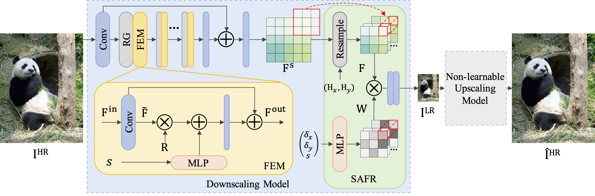

# SAID-PyTorch

PyTorch implementation of paper **"Learned Scale-arbitrary Image Downscaling for Non-learnable Upscaling"**



## Inference

Download HR images:
- [Benchmark datasets (Set5, Set14, B100, and Urban100)](https://mega.nz/file/KddyXBjZ#GLISyPobRu9KCRGXUcfvCfEUjvIkadVXMSv8Hu-3bIc)
- [DIV2K validation set](http://data.vision.ee.ethz.ch/cvl/DIV2K/DIV2K_valid_HR.zip)

Run:
```bash
# Ours + Bicubic
python run.py -model SAID_Bicubic -in_dir IMAGES_PATH -out_dir RESULTS_PATH -gpu 0 -scale 2.0
# Ours + Lanczos
python run.py -model SAID_Lanczos -in_dir IMAGES_PATH -out_dir RESULTS_PATH -gpu 0 -scale 2.0
```

## Contact

If you have any questions, please contact crhuang@whu.edu.cn.